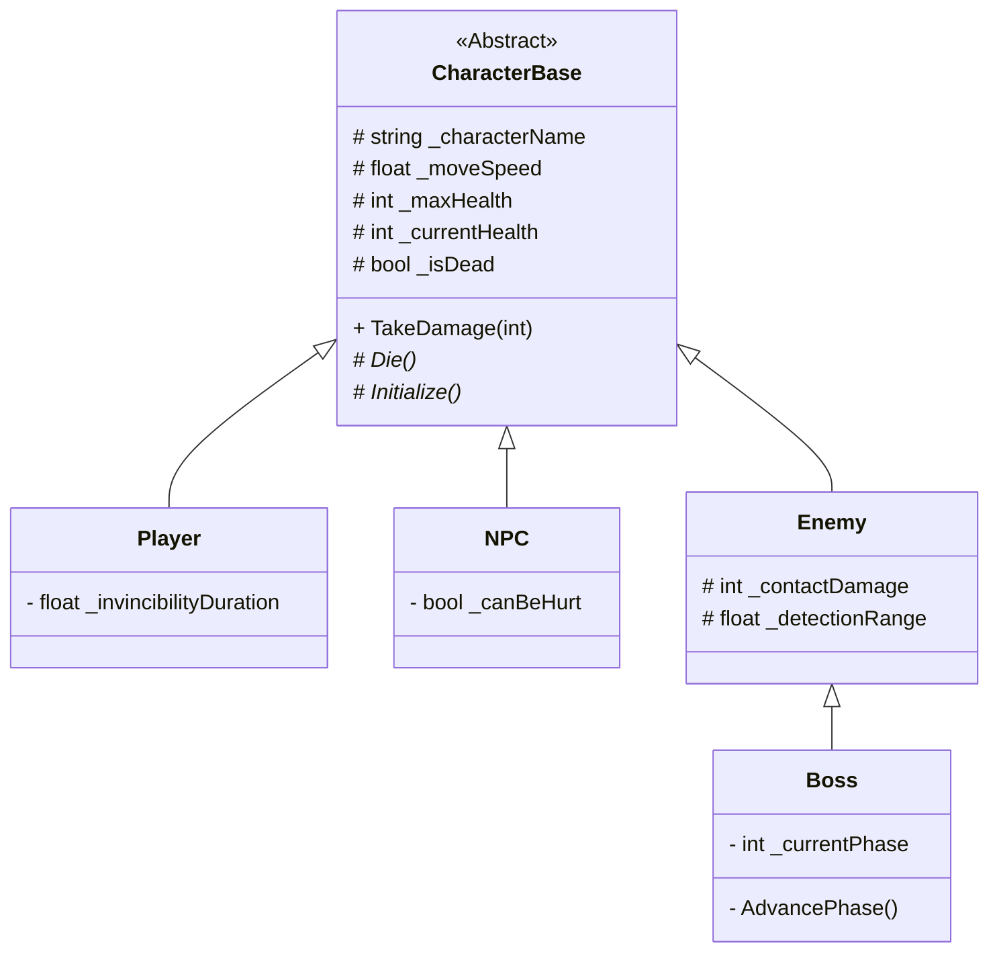

# Sistema de Personagens (POO) - Hora-Extra

Este sistema utiliza herança para centralizar as propriedades e comportamentos básicos de todos os personagens (jogadores, inimigos, NPCs) no projeto.

## Hierarquia de Classes

## Descrição dos Componentes

### 1. CharacterBase (Abstrata)
A espinha dorsal de qualquer entidade viva no jogo. Herda de `MonoBehaviour`, mas por ser abstrata, não pode ser anexada diretamente a GameObjects. 
- **Namespace**: `HoraExtra.Characters`
- **Atributos Principais**:
    - `_characterName`: Nome identificador.
    - `_currentHealth` / `_maxHealth`: Controle de vitalidade.
    - `_moveSpeed`: Base para sistemas de movimentação futuros.

### 2. Player
Extensão da base focada no personagem controlado pelo usuário.
- **Diferencial**: Capacidade de gerenciar invulnerabilidade e futuramente lógica de inputs.

### 3. NPC
Para personagens interativos e não hostis.
- **Diferencial**: Possui flag `_canBeHurt` para evitar danos acidentais em cidades ou zonas seguras.

### 4. Enemy
Base para ameaças.
- **Diferencial**: Introduz o conceito de dano por contato e alcance de detecção.

### 5. Boss
Inimigos formidáveis com estados complexos.
- **Diferencial**: Herda de `Enemy` para reutilizar lógica de contato, mas implementa um sistema de fases baseado em HP.

## Como utilizar

1. No Unity Editor, crie um GameObject.
2. Anexe um dos scripts filhos (`Player`, `NPC`, `Enemy` ou `Boss`).
3. Configure os valores no **Inspector** (organizados por `Headers` e `Tooltips`).
4. Para estender a funcionalidade de um método base (como `TakeDamage`), utilize `override` chamando `base.TakeDamage(amount)` se desejar manter o comportamento original de reduzir vida.
